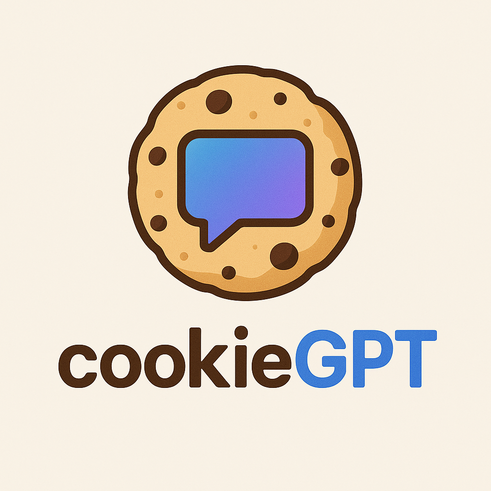

# Cookie design chat

_Automatically synced with your [v0.dev](https://v0.dev) deployments_

## Overview

Cookie-GPT is an innovative application that leverages AI to transform user-provided images into custom cookie cutter designs. Users can upload an image, and the system will process it to generate a corresponding SVG (for 2D representation) and STL (for 3D printing) file, enabling the creation of unique physical cookie cutters.

